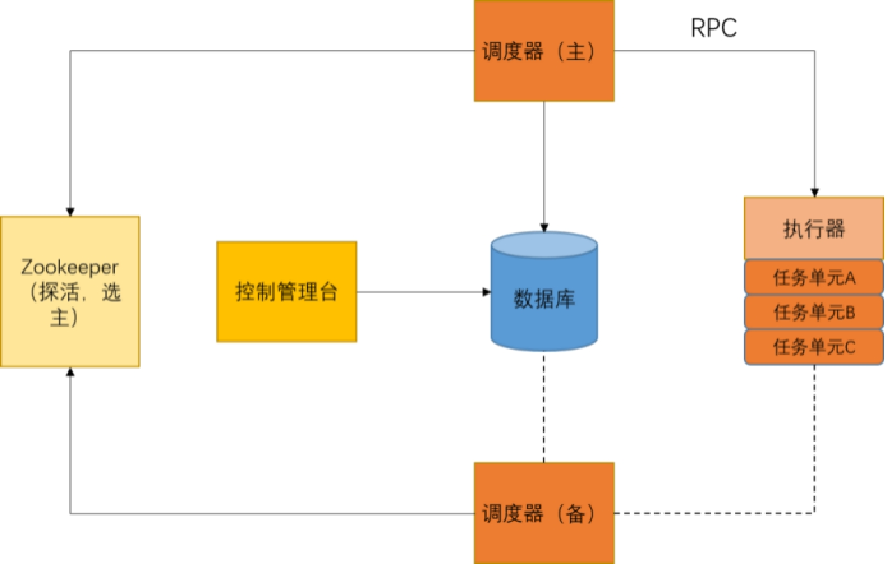

## 如何设计一款好用的分布式定时任务系统？

​		在日常开发中，我们经常会碰到需要设计一个定时任务去批量处理某个业务的情况，例如基金公司每天早上会计算投资人的收益。在单机环境下，我们开发一个定时任务，用JDK的Timer类或者Collection包下的ScheduledExecutorService就可以实现，但是应用一旦分布式部署，那每个节点都会执行相同的任务，显然这不是我们想看到的，所以在分布式环境下，我们需要一个分布式调度系统，将我们的任务去集中化的管理，统一调度。

​		一个分布式任务调度系统里面，需要有调度器，调度器需要下发指令给执行器，调度器可以根据路由算法，选择把任务指令下发给哪台机器，调度器需要设计定时任务什么时候去触发，如图：

 

​		如果执行定时任务的接口加一个幂等功能，可以简化定时任务触发模块的设计：
1、每个定时任务执行都需要从“令牌桶”中获得一个对应的令牌后才能执行。

2、1个令牌只能使用一次。
3、定时任务触发时，保证同一次任务获得同一个令牌，这样就不用担心集群模式下超发请求。

​		如果执行定时任务的接口不能保证幂等性，需要考虑以下问题：
1、同一时间段接收到多次执行请求（网络、触发程序发起重试等）。
2、主备都宕机了。
3、主备切换时可能导致的时差。

 

## 如何实现跨语言的RPC调用？

​		不同的开发语言有着不同的擅长领域，例如 Python 语言更适合于人工智能编程，C++ 倾向于用来做系统的底层开发，而 Java 则主要是研发后台服务的首选，因此同一个公司可能会同时使用多种开发语言。那么这些不同语言开发出来的产品，它们相互之间调用所使用的融合技术就称为 RPC 。

​		具体来说RPC会通过网络来调用不同节点上的服务，并且这些服务既可以是相同语言开发，也可由不同语言开发。因此,RPC就可以让不同语言像调用本地方法一样，去调用远程的其他语言了。

RPC包括分布式服务，寻址服务，序列化以及反序列化等。而跨语言RPC的调用，首先需要寻找出各个语言共同支持的通用数据结构，然后再将这种通用的数据结构使用某种语言通过网络再发送给另一种语言。因此，跨语言RPC核心为：

1、 通用数据结构

2、 网络编程

​		从宏观上来讲，通用数据结构分为文件和二进制数据，因为我们知道，任何编程语言都支持对文件的读写操作，任何编程语言也可以实现对二进制数据的解析。

​		使用文件这种方式典型的代表是web service ，比如说使用java调用远端的C服务，此时可以将方法名，参数，返回值等信息封装到一个称之为WSDL的XML文件之中，之后java来解析这个XML文件。现在已经很少有公司使用web service技术，因为其存在严重的效率问题。因为这种通信方式使用的是XML文件，而XML文件包含了大量无实际意义的标签元素，这些标签会增大网络传输的文件容量，从而对文件的编码，解码以及网络传输都带来负面的影响。

​		从网络层面上来讲，再网络七层模型中，层级越高，传输时经过的路径就越长，因此传输的效率就越低，web service是基于HTTP协议的，而HTTP协议位于网络第七层，因此web service的传输效率太低。

所以，目前RPC调用所涉及的两个关键问题：

1、 传输文件体积过大，无用数据过多；

2、 网络传输路径太长。

​		将传输文件直接序列化为二进制文件，这样会减少了数据的传输容量，并且参数基于TCP的网络模型进行传输，TCP处于OSI模型第四层，因此可以减少网络的传输路径，提高传输效率。

​		目前主流的RPC实现技术：

1、 Protobuf

2、 Thrift

​		主要分为6步：

1、 根据规范编写一个数据描述文件；

2、 使用转换工具转换数据描述文件；

3、 使用开发语言将转换后的数据描述文件翻译为通用的数据格式，比如字节数组；

4、 将字节数据通过Socket编程由网络传输给了远端的另一种编程语言；

5、 远端编程语言将字节数组转换为自身能够识别的数据结构；

6、 根据相应的数据结构，调用本地方法，实现不同的功能。

 